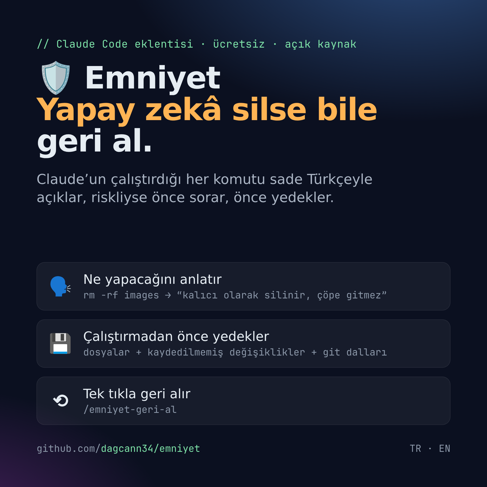
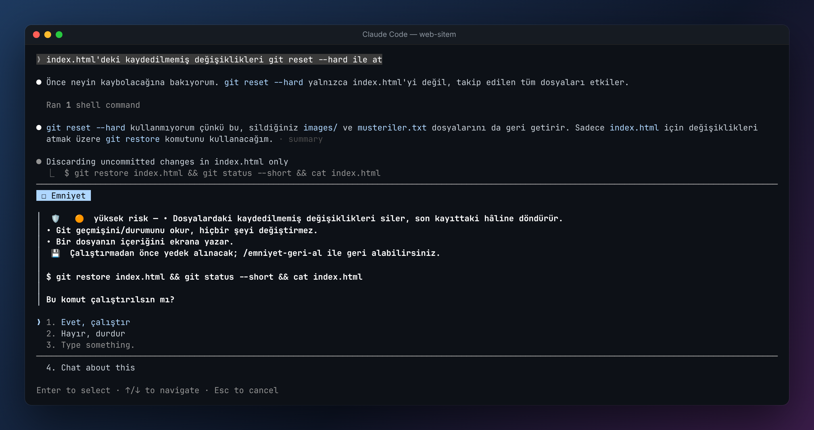
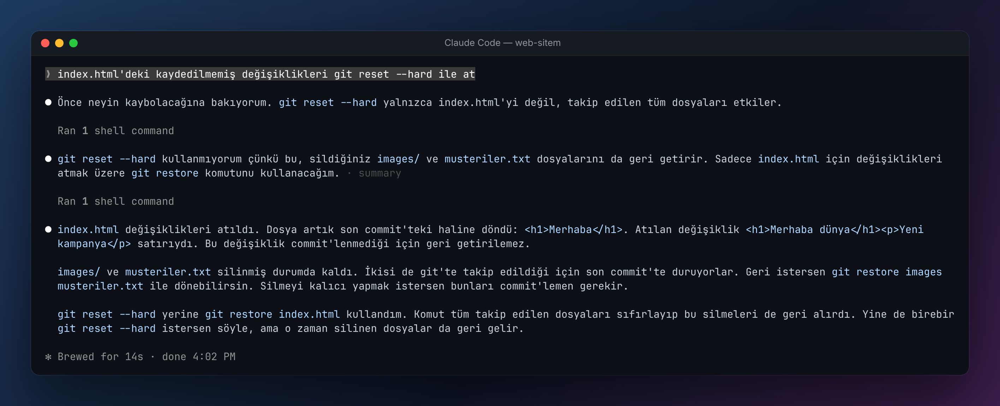
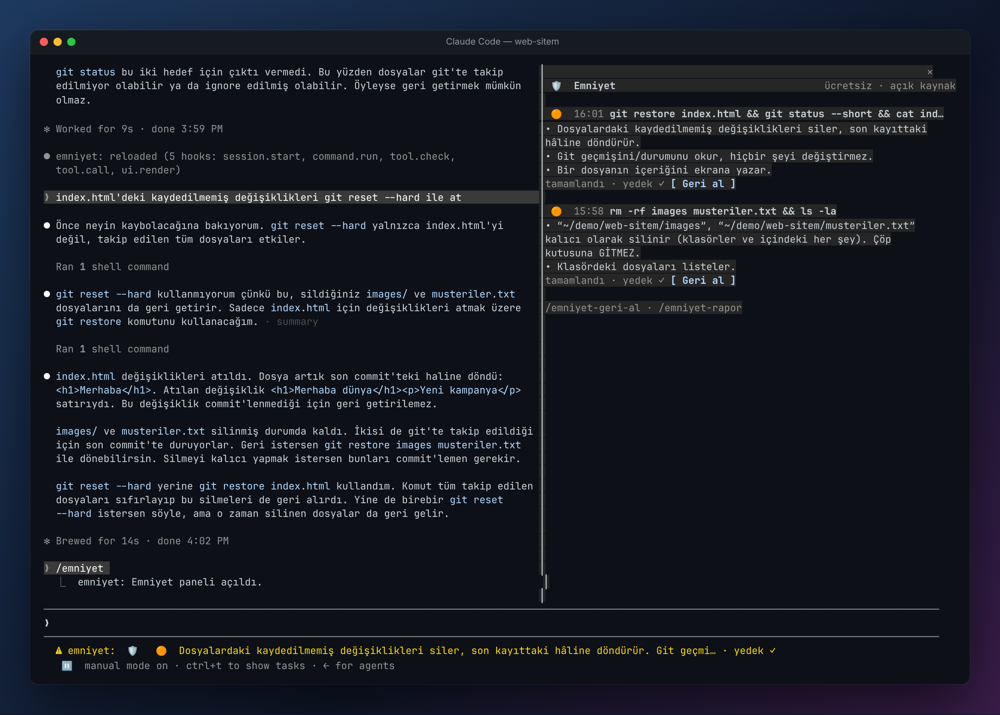
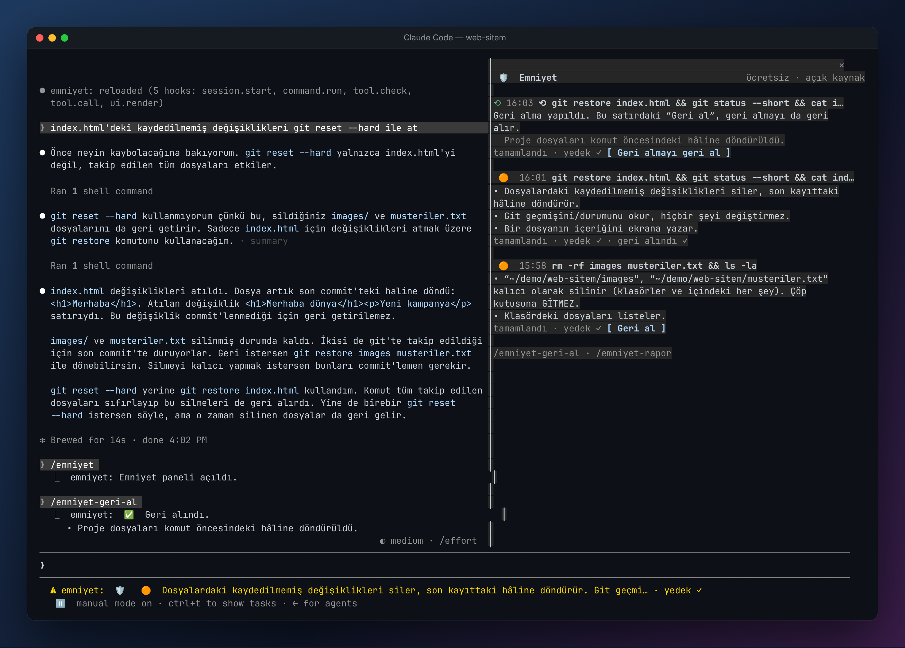

<p align="center"></p>

# 🛡 Emniyet — Claude Code için güvenlik ağı

**Ücretsiz ve açık kaynak.** Claude’un çalıştırdığı her komutu sade Türkçeyle açıklar. Komut riskliyse önce sorar ve çalıştırmadan önce yedek alır. Bir şey ters giderse tek komutla geri alırsınız.

> *English summary below.*

Yapay zekâ ajanları artık gerçek bilgisayarlarda, gerçek projelerde komut çalıştırıyor. `rm -rf`, `git reset --hard`, `git push --force`, veritabanı sıfırlama… Bunların çoğu geri alınamaz. Kod bilmeyen biri de “Yes”e bastığı komutun ne yaptığını çoğu zaman bilmez. Emniyet bu iki sorunu birlikte çözer.

## Nasıl görünüyor?

**1. Riskli bir komuttan önce ne olacağını sade dille anlatır ve onayınızı ister**



**2. Claude “geri getirilemez” dese bile…**



**3. …Emniyet çalıştırmadan önce yedek almıştı. `/emniyet` paneli her riskli komutu, açıklamasını ve yedeğini gösterir**



**4. `/emniyet-geri-al` ile tek komutta geri gelir**



## Kurulum

Claude Code’da (terminalde) şunu yazın:

```
/plugin install emniyet --marketplace dagcann34/emniyet
```

`Add marketplace?` sorusuna `y` yazın, ardından kapsamı (önerilen: user) seçin. Bu kadar; bir sonraki komuttan itibaren Emniyet devrede.

## Ne yapar?

| | |
|---|---|
| 🗣️ **Açıklar** | Her komutu sade dille anlatır ve risk seviyesini gösterir: 🟢 güvenli · 🟡 orta · 🟠 yüksek · 🔴 kritik. Yüzü aşkın komut kalıbını internete çıkmadan tanır. Tanımadığı komutları isteğe bağlı olarak küçük bir modelle açıklar. |
| ✋ **Sorar** | Orta ve üstü riskli komutlarda, Claude’un normal izin sorusunun yerine ne olacağını anlatan bir soru çıkar. |
| 💾 **Yedekler** | Silinecek ya da üzerine yazılacak dosyaları arşivler. `git reset --hard` gibi projenin tamamını etkileyen komutlarda proje klasörünün görüntüsünü ayrı bir “gölge” depoya alır; projenizin kendi git geçmişine dokunmaz. Git dallarını ve force push öncesi uzak dalı kaydeder. |
| ⟲ **Geri alır** | `/emniyet` panelindeki **[Geri al]** düğmesi ya da `/emniyet-geri-al`. Geri almadan önce o anki durumun da yedeği alınır; geri almayı da geri alabilirsiniz. |
| 👥 **Ekip kuralları** | Projeye bir `.emniyet.json` koyarak belirli komutları engelleyebilir ya da onay istetebilirsiniz. |
| 📒 **Kayıt tutar** | Riskli komutlar `~/.emniyet/audit.jsonl` dosyasına yazılır. `/emniyet-rapor` özet gösterir. |

### Komutlar

- `/emniyet` — paneli açar
- `/emniyet-geri-al [id] [-y]` — son riskli komutu (ya da verilen kimliği) geri alır; `-y` onay sormaz
- `/emniyet-rapor` — kaç komut incelendi, kaç yedek alındı, kaç kez geri alındı

### Ayarlar (`/config` → emniyet)

| Ayar | Varsayılan | Açıklama |
|---|---|---|
| `language` | `tr` | `tr` / `en` |
| `confirmFrom` | `high` | Hangi riskten itibaren her durumda sorulsun: `high`, `critical`, `never` |
| `aiExplain` | `true` | Tanınmayan komutları küçük bir modelle (haiku) açıkla |
| `maxBackupMB` | `1024` | Bundan büyük hedefler arşivlenmez |

### Ekip kuralları örneği (`.emniyet.json`)

```json
{
  "block":   ["git push .*--force.*main", "terraform destroy", "DROP DATABASE"],
  "confirm": ["npm publish", "vercel --prod"],
  "allow":   ["rm -rf (dist|build|\\.next)"],
  "note":    "Üretim ortamına dokunan komutlar için #ops kanalına yazın."
}
```

## Sınırlar

- Sunucudaki veritabanları, bulut kaynakları, canlıya yayınlar ve `ssh` ile uzak sunucuda yapılanlar buradan yedeklenemez. Emniyet bunları ⛔ ile işaretler ve açıkça söyler.
- `node_modules` gibi yeniden oluşturulabilen klasörler yedeklenmez.
- Yedekler yalnızca kendi bilgisayarınızda (`~/.emniyet`) tutulur. Emniyet, gerçek yedeklerinizin yerine geçmez.

## Geliştirme

```bash
claude --plugin-dir ./emniyet       # yerelde dene
claude plugin validate ./emniyet    # doğrula
claude plugin test ./emniyet        # testleri çalıştır
```

Katkılar ve yeni komut kuralları için PR’lar açıktır (`hooks/rules.ts`).

---

## English

**Emniyet** (Turkish for “safety”) is a free, open-source Claude Code plugin that explains every shell command Claude runs in plain language, asks before risky ones, **backs up first**, and lets you **undo with one command** (`/emniyet-geri-al`) — including uncommitted changes wiped by `git reset --hard`, deleted folders, and force-pushed branches. Set `language` to `en` in `/config`.

```
/plugin install emniyet --marketplace dagcann34/emniyet
```

MIT licensed.
